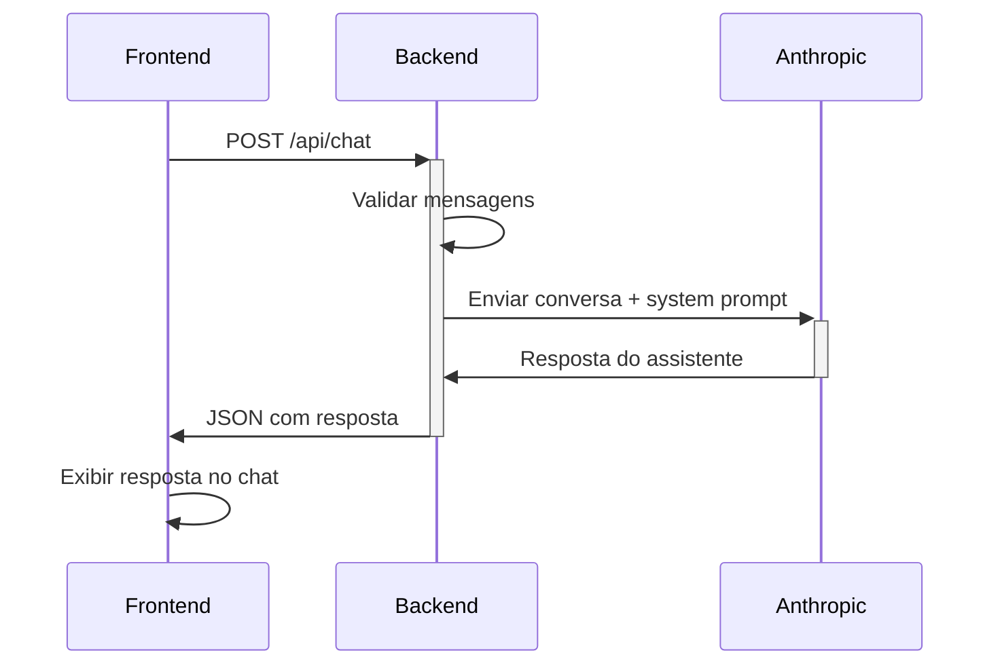

# 🔌 API Reference - Assistente Alan Weiss

> Documentação técnica da API do Assistente de Consultoria Estratégica

## 📋 Visão Geral

A API do Assistente Alan Weiss é construída em Node.js + Express e integra-se com a API da Anthropic para fornecer respostas baseadas na metodologia de consultoria estratégica.

**Base URL**: `http://localhost:3001/api`

## 🔐 Autenticação

A API utiliza a chave da Anthropic configurada no servidor via variável de ambiente `ANTHROPIC_API_KEY`. Não há autenticação adicional necessária para o frontend.

## 📍 Endpoints

### Health Check

#### `GET /api/health`

Verifica se a API está funcionando e se a chave da Anthropic está configurada.

**Resposta de Sucesso:**
```json
{
  "status": "ok",
  "message": "API configurada"
}
```

**Resposta de Erro:**
```json
{
  "status": "error",
  "message": "ANTHROPIC_API_KEY não encontrada"
}
```

**Códigos de Status:**
- `200 OK`: API funcionando corretamente
- `200 OK`: API funcionando mas sem chave configurada (status: error)

---

### Chat

#### `POST /api/chat`

Envia uma conversa para o assistente e recebe uma resposta baseada na metodologia Alan Weiss.

**Parâmetros do Body:**

| Campo | Tipo | Obrigatório | Descrição |
|-------|------|-------------|----------|
| `messages` | Array | Sim | Array de mensagens da conversa |

**Estrutura de Message:**

| Campo | Tipo | Valores | Descrição |
|-------|------|---------|----------|
| `role` | String | `user`, `assistant` | Papel da mensagem |
| `content` | String | - | Conteúdo da mensagem |

**Exemplo de Request:**
```json
{
  "messages": [
    {
      "role": "user",
      "content": "Como devo precificar um projeto de consultoria?"
    },
    {
      "role": "assistant",
      "content": "Para precificar baseado em valor..."
    },
    {
      "role": "user",
      "content": "E se o cliente insistir em pagar por hora?"
    }
  ]
}
```

**Resposta de Sucesso:**
```json
{
  "response": "Quando um cliente insiste em pagar por hora, é importante educá-lo sobre o conflito de interesses que isso cria. Explique que..."
}
```

**Respostas de Erro:**

```json
// 400 Bad Request - Payload inválido
{
  "error": "Messages array é obrigatório"
}
```

```json
// 400 Bad Request - Mensagens inválidas
{
  "error": "Nenhuma mensagem válida encontrada"
}
```

```json
// 500 Internal Server Error - Erro do servidor
{
  "error": "Erro interno do servidor",
  "details": "Mensagem específica do erro"
}
```

**Códigos de Status:**
- `200 OK`: Resposta gerada com sucesso
- `400 Bad Request`: Parâmetros inválidos
- `500 Internal Server Error`: Erro interno do servidor ou API da Anthropic

---

## ⚙️ Configuração

### Variáveis de Ambiente

| Variável | Obrigatória | Padrão | Descrição |
|----------|-------------|--------|----------|
| `ANTHROPIC_API_KEY` | Sim | - | Chave da API da Anthropic |
| `PORT` | Não | `3001` | Porta do servidor |
| `NODE_ENV` | Não | `development` | Ambiente de execução |

### Arquivo .env
```bash
ANTHROPIC_API_KEY=sk-ant-sua_chave_aqui
PORT=3001
NODE_ENV=production
```

## 🤖 Integração com Anthropic

### Configuração da API

```javascript
const response = await fetch('https://api.anthropic.com/v1/messages', {
  method: 'POST',
  headers: {
    'Content-Type': 'application/json',
    'x-api-key': API_KEY,
    'anthropic-version': '2023-06-01'
  },
  body: JSON.stringify({
    model: 'claude-3-sonnet-20240229',
    max_tokens: 1000,
    system: SYSTEM_PROMPT,
    messages: messages
  })
});
```

### System Prompt

O assistente utiliza um system prompt especializado que inclui:

- **Filosofia Fundamental** da metodologia Alan Weiss
- **Frameworks Principais** (O-M-V, Curva de Aceleração, etc.)
- **Princípios Inegociáveis** sobre consultoria baseada em valor
- **Contexto Específico** para transição de agência para consultoria

## 🔄 Fluxo de Dados



## 🛡️ Segurança

### Headers de Segurança

O servidor inclui headers básicos de segurança:

```javascript
app.use(cors()); // CORS habilitado
app.use(express.json()); // Parse JSON limitado
```

### Validação de Input

- **Tipo de dados**: Verifica se `messages` é um array
- **Estrutura**: Valida se mensagens têm `role` e `content`
- **Roles válidas**: Aceita apenas `user` e `assistant`
- **Conteúdo**: Filtra mensagens vazias

### Rate Limiting

⚠️ **Não implementado**: Para produção, recomenda-se adicionar rate limiting:

```javascript
const rateLimit = require('express-rate-limit');

const limiter = rateLimit({
  windowMs: 15 * 60 * 1000, // 15 minutos
  max: 100 // máximo 100 requests por IP
});

app.use('/api/', limiter);
```

## 📊 Monitoramento

### Logs

O servidor registra:

- ✅ Inicialização do servidor
- ✅ Status da configuração da API
- ✅ Erros de API
- ⚠️ **Não implementado**: Logs estruturados de requests

### Métricas Sugeridas

Para produção, monitore:

- **Requests por minuto**
- **Tempo de resposta da API**
- **Taxa de erro**
- **Uso de tokens da Anthropic**
- **Uptime do servidor**

## 🚀 Deploy

### Vercel

**vercel.json:**
```json
{
  "functions": {
    "server.js": {
      "maxDuration": 30
    }
  },
  "routes": [
    {
      "src": "/api/(.*)",
      "dest": "/server.js"
    },
    {
      "src": "/(.*)",
      "dest": "/public/$1"
    }
  ]
}
```

### Railway

**railway.json:**
```json
{
  "deploy": {
    "startCommand": "npm start",
    "healthcheckPath": "/api/health"
  }
}
```

### Docker

**Dockerfile:**
```dockerfile
FROM node:18-alpine
WORKDIR /app
COPY package*.json ./
RUN npm ci --only=production
COPY . .
EXPOSE 3001
CMD ["npm", "start"]
```

## 🧪 Testes

### Teste de Health Check

```bash
curl -X GET http://localhost:3001/api/health
```

### Teste de Chat

```bash
curl -X POST http://localhost:3001/api/chat \
  -H "Content-Type: application/json" \
  -d '{
    "messages": [
      {
        "role": "user",
        "content": "Como identificar o comprador econômico?"
      }
    ]
  }'
```

### Teste com JavaScript

```javascript
// Teste básico de funcionamento
async function testApi() {
  try {
    // Health check
    const health = await fetch('/api/health');
    console.log('Health:', await health.json());
    
    // Chat test
    const chat = await fetch('/api/chat', {
      method: 'POST',
      headers: { 'Content-Type': 'application/json' },
      body: JSON.stringify({
        messages: [
          { role: 'user', content: 'Teste de conexão' }
        ]
      })
    });
    
    console.log('Chat:', await chat.json());
  } catch (error) {
    console.error('Erro:', error);
  }
}

testApi();
```

## 🔧 Troubleshooting

### Problemas Comuns

#### 1. "ANTHROPIC_API_KEY não configurada"
**Solução:**
```bash
# Verifique se o arquivo .env existe
ls -la .env

# Verifique o conteúdo
cat .env

# Reinicie o servidor
npm run dev
```

#### 2. "Erro na API da Anthropic: 401"
**Solução:**
- Verifique se a chave da API está correta
- Confirme que tem créditos na conta Anthropic
- Teste a chave no console da Anthropic

#### 3. "Cannot find module"
**Solução:**
```bash
# Reinstale dependências
rm -rf node_modules package-lock.json
npm install
```

#### 4. "EADDRINUSE: address already in use"
**Solução:**
```bash
# Linux/Mac
kill -9 $(lsof -ti:3001)

# Windows
netstat -ano | findstr :3001
taskkill /PID <PID> /F
```

### Debug Mode

Para debugar, adicione logs extras:

```javascript
// Em server.js
console.log('Request body:', req.body);
console.log('Messages:', validMessages);
console.log('API Response:', response);
```

## 📝 Changelog

### v1.0.0
- ✅ Implementação inicial
- ✅ Integração com Anthropic API
- ✅ Health check endpoint
- ✅ Chat endpoint básico
- ✅ System prompt especializado

### Próximas Versões
- 🔄 Rate limiting
- 🔄 Logs estruturados
- 🔄 Métricas de performance
- 🔄 Cache de respostas
- 🔄 Websockets para real-time

---

**Precisa de ajuda?** Abra uma issue no [GitHub](https://github.com/joaobrio/assistente-alan-weiss/issues) ou consulte o [guia do Cursor AI](cursor-ai-guide.md) para implementação automatizada.